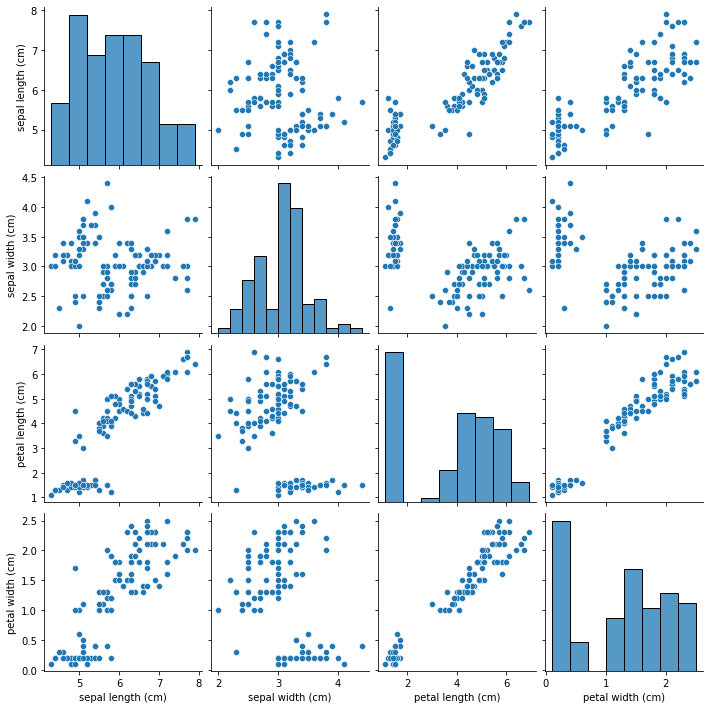
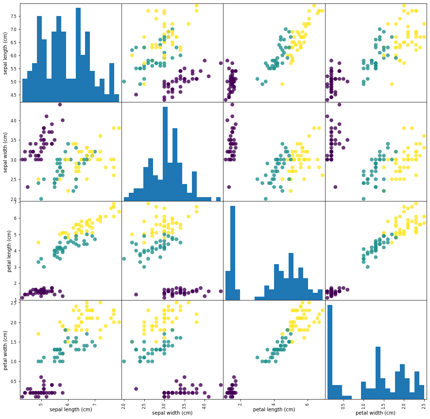
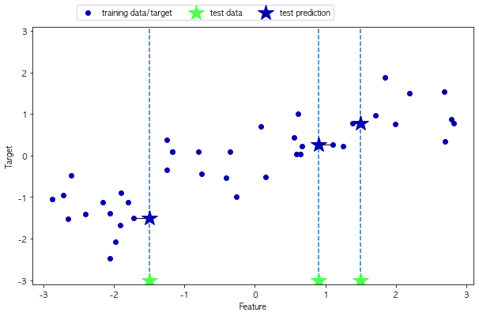
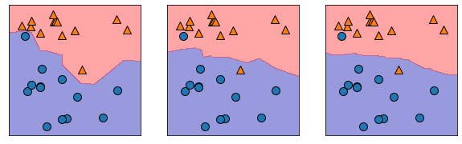
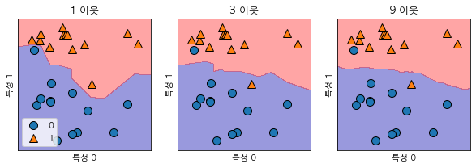
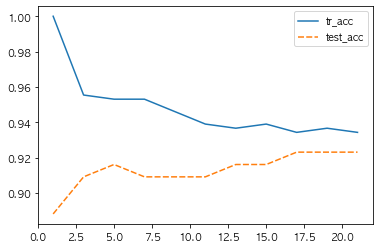
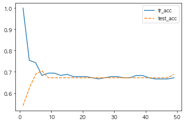

```python
import sys
import pandas as pd
```


```python
print(sys.version)
print(pd.__version__)
```

    3.8.5 (default, Sep  4 2020, 02:22:02) 
    [Clang 10.0.0 ]
    1.1.3


```python
import matplotlib
import numpy as np
import scipy as sc
```


```python
print(matplotlib.__version__)
print(np.__version__)
print(sc.__version__)
```

    3.3.2
    1.19.2
    1.5.2


```python
from sklearn.datasets import load_iris
iris = load_iris()
iris
```


    {'data': array([[5.1, 3.5, 1.4, 0.2],
            [4.9, 3. , 1.4, 0.2],
            [4.7, 3.2, 1.3, 0.2],
            [4.6, 3.1, 1.5, 0.2],
            [5. , 3.6, 1.4, 0.2],
            [5.4, 3.9, 1.7, 0.4],
            [4.6, 3.4, 1.4, 0.3],
            [5. , 3.4, 1.5, 0.2],
            [4.4, 2.9, 1.4, 0.2],
            [4.9, 3.1, 1.5, 0.1],
            [5.4, 3.7, 1.5, 0.2],
            [4.8, 3.4, 1.6, 0.2],
            [4.8, 3. , 1.4, 0.1],
            [4.3, 3. , 1.1, 0.1],
            [5.8, 4. , 1.2, 0.2],
            [5.7, 4.4, 1.5, 0.4],
            [5.4, 3.9, 1.3, 0.4],
            [5.1, 3.5, 1.4, 0.3],
            [5.7, 3.8, 1.7, 0.3],
            [5.1, 3.8, 1.5, 0.3],
            [5.4, 3.4, 1.7, 0.2],
            [5.1, 3.7, 1.5, 0.4],
            [4.6, 3.6, 1. , 0.2],
            [5.1, 3.3, 1.7, 0.5],
            [4.8, 3.4, 1.9, 0.2],
            [5. , 3. , 1.6, 0.2],
            [5. , 3.4, 1.6, 0.4],
            [5.2, 3.5, 1.5, 0.2],
            [5.2, 3.4, 1.4, 0.2],
            [4.7, 3.2, 1.6, 0.2],
            [4.8, 3.1, 1.6, 0.2],
            [5.4, 3.4, 1.5, 0.4],
            [5.2, 4.1, 1.5, 0.1],
            [5.5, 4.2, 1.4, 0.2],
            [4.9, 3.1, 1.5, 0.2],
            [5. , 3.2, 1.2, 0.2],
            [5.5, 3.5, 1.3, 0.2],
            [4.9, 3.6, 1.4, 0.1],
            [4.4, 3. , 1.3, 0.2],
            [5.1, 3.4, 1.5, 0.2],
            [5. , 3.5, 1.3, 0.3],
            [4.5, 2.3, 1.3, 0.3],
            [4.4, 3.2, 1.3, 0.2],
            [5. , 3.5, 1.6, 0.6],
            [5.1, 3.8, 1.9, 0.4],
            [4.8, 3. , 1.4, 0.3],
            [5.1, 3.8, 1.6, 0.2],
            [4.6, 3.2, 1.4, 0.2],
            [5.3, 3.7, 1.5, 0.2],
            [5. , 3.3, 1.4, 0.2],
            [7. , 3.2, 4.7, 1.4],
            [6.4, 3.2, 4.5, 1.5],
            [6.9, 3.1, 4.9, 1.5],
            [5.5, 2.3, 4. , 1.3],
            [6.5, 2.8, 4.6, 1.5],
            [5.7, 2.8, 4.5, 1.3],
            [6.3, 3.3, 4.7, 1.6],
            [4.9, 2.4, 3.3, 1. ],
            [6.6, 2.9, 4.6, 1.3],
            [5.2, 2.7, 3.9, 1.4],
            [5. , 2. , 3.5, 1. ],
            [5.9, 3. , 4.2, 1.5],
            [6. , 2.2, 4. , 1. ],
            [6.1, 2.9, 4.7, 1.4],
            [5.6, 2.9, 3.6, 1.3],
            [6.7, 3.1, 4.4, 1.4],
            [5.6, 3. , 4.5, 1.5],
            [5.8, 2.7, 4.1, 1. ],
            [6.2, 2.2, 4.5, 1.5],
            [5.6, 2.5, 3.9, 1.1],
            [5.9, 3.2, 4.8, 1.8],
            [6.1, 2.8, 4. , 1.3],
            [6.3, 2.5, 4.9, 1.5],
            [6.1, 2.8, 4.7, 1.2],
            [6.4, 2.9, 4.3, 1.3],
            [6.6, 3. , 4.4, 1.4],
            [6.8, 2.8, 4.8, 1.4],
            [6.7, 3. , 5. , 1.7],
            [6. , 2.9, 4.5, 1.5],
            [5.7, 2.6, 3.5, 1. ],
            [5.5, 2.4, 3.8, 1.1],
            [5.5, 2.4, 3.7, 1. ],
            [5.8, 2.7, 3.9, 1.2],
            [6. , 2.7, 5.1, 1.6],
            [5.4, 3. , 4.5, 1.5],
            [6. , 3.4, 4.5, 1.6],
            [6.7, 3.1, 4.7, 1.5],
            [6.3, 2.3, 4.4, 1.3],
            [5.6, 3. , 4.1, 1.3],
            [5.5, 2.5, 4. , 1.3],
            [5.5, 2.6, 4.4, 1.2],
            [6.1, 3. , 4.6, 1.4],
            [5.8, 2.6, 4. , 1.2],
            [5. , 2.3, 3.3, 1. ],
            [5.6, 2.7, 4.2, 1.3],
            [5.7, 3. , 4.2, 1.2],
            [5.7, 2.9, 4.2, 1.3],
            [6.2, 2.9, 4.3, 1.3],
            [5.1, 2.5, 3. , 1.1],
            [5.7, 2.8, 4.1, 1.3],
            [6.3, 3.3, 6. , 2.5],
            [5.8, 2.7, 5.1, 1.9],
            [7.1, 3. , 5.9, 2.1],
            [6.3, 2.9, 5.6, 1.8],
            [6.5, 3. , 5.8, 2.2],
            [7.6, 3. , 6.6, 2.1],
            [4.9, 2.5, 4.5, 1.7],
            [7.3, 2.9, 6.3, 1.8],
            [6.7, 2.5, 5.8, 1.8],
            [7.2, 3.6, 6.1, 2.5],
            [6.5, 3.2, 5.1, 2. ],
            [6.4, 2.7, 5.3, 1.9],
            [6.8, 3. , 5.5, 2.1],
            [5.7, 2.5, 5. , 2. ],
            [5.8, 2.8, 5.1, 2.4],
            [6.4, 3.2, 5.3, 2.3],
            [6.5, 3. , 5.5, 1.8],
            [7.7, 3.8, 6.7, 2.2],
            [7.7, 2.6, 6.9, 2.3],
            [6. , 2.2, 5. , 1.5],
            [6.9, 3.2, 5.7, 2.3],
            [5.6, 2.8, 4.9, 2. ],
            [7.7, 2.8, 6.7, 2. ],
            [6.3, 2.7, 4.9, 1.8],
            [6.7, 3.3, 5.7, 2.1],
            [7.2, 3.2, 6. , 1.8],
            [6.2, 2.8, 4.8, 1.8],
            [6.1, 3. , 4.9, 1.8],
            [6.4, 2.8, 5.6, 2.1],
            [7.2, 3. , 5.8, 1.6],
            [7.4, 2.8, 6.1, 1.9],
            [7.9, 3.8, 6.4, 2. ],
            [6.4, 2.8, 5.6, 2.2],
            [6.3, 2.8, 5.1, 1.5],
            [6.1, 2.6, 5.6, 1.4],
            [7.7, 3. , 6.1, 2.3],
            [6.3, 3.4, 5.6, 2.4],
            [6.4, 3.1, 5.5, 1.8],
            [6. , 3. , 4.8, 1.8],
            [6.9, 3.1, 5.4, 2.1],
            [6.7, 3.1, 5.6, 2.4],
            [6.9, 3.1, 5.1, 2.3],
            [5.8, 2.7, 5.1, 1.9],
            [6.8, 3.2, 5.9, 2.3],
            [6.7, 3.3, 5.7, 2.5],
            [6.7, 3. , 5.2, 2.3],
            [6.3, 2.5, 5. , 1.9],
            [6.5, 3. , 5.2, 2. ],
            [6.2, 3.4, 5.4, 2.3],
            [5.9, 3. , 5.1, 1.8]]),
     'target': array([0, 0, 0, 0, 0, 0, 0, 0, 0, 0, 0, 0, 0, 0, 0, 0, 0, 0, 0, 0, 0, 0,
            0, 0, 0, 0, 0, 0, 0, 0, 0, 0, 0, 0, 0, 0, 0, 0, 0, 0, 0, 0, 0, 0,
            0, 0, 0, 0, 0, 0, 1, 1, 1, 1, 1, 1, 1, 1, 1, 1, 1, 1, 1, 1, 1, 1,
            1, 1, 1, 1, 1, 1, 1, 1, 1, 1, 1, 1, 1, 1, 1, 1, 1, 1, 1, 1, 1, 1,
            1, 1, 1, 1, 1, 1, 1, 1, 1, 1, 1, 1, 2, 2, 2, 2, 2, 2, 2, 2, 2, 2,
            2, 2, 2, 2, 2, 2, 2, 2, 2, 2, 2, 2, 2, 2, 2, 2, 2, 2, 2, 2, 2, 2,
            2, 2, 2, 2, 2, 2, 2, 2, 2, 2, 2, 2, 2, 2, 2, 2, 2, 2]),
     'frame': None,
     'target_names': array(['setosa', 'versicolor', 'virginica'], dtype='<U10'),
     'DESCR': '.. _iris_dataset:\n\nIris plants dataset\n--------------------\n\n**Data Set Characteristics:**\n\n    :Number of Instances: 150 (50 in each of three classes)\n    :Number of Attributes: 4 numeric, predictive attributes and the class\n    :Attribute Information:\n        - sepal length in cm\n        - sepal width in cm\n        - petal length in cm\n        - petal width in cm\n        - class:\n                - Iris-Setosa\n                - Iris-Versicolour\n                - Iris-Virginica\n                \n    :Summary Statistics:\n\n    ============== ==== ==== ======= ===== ====================\n                    Min  Max   Mean    SD   Class Correlation\n    ============== ==== ==== ======= ===== ====================\n    sepal length:   4.3  7.9   5.84   0.83    0.7826\n    sepal width:    2.0  4.4   3.05   0.43   -0.4194\n    petal length:   1.0  6.9   3.76   1.76    0.9490  (high!)\n    petal width:    0.1  2.5   1.20   0.76    0.9565  (high!)\n    ============== ==== ==== ======= ===== ====================\n\n    :Missing Attribute Values: None\n    :Class Distribution: 33.3% for each of 3 classes.\n    :Creator: R.A. Fisher\n    :Donor: Michael Marshall (MARSHALL%PLU@io.arc.nasa.gov)\n    :Date: July, 1988\n\nThe famous Iris database, first used by Sir R.A. Fisher. The dataset is taken\nfrom Fisher\'s paper. Note that it\'s the same as in R, but not as in the UCI\nMachine Learning Repository, which has two wrong data points.\n\nThis is perhaps the best known database to be found in the\npattern recognition literature.  Fisher\'s paper is a classic in the field and\nis referenced frequently to this day.  (See Duda & Hart, for example.)  The\ndata set contains 3 classes of 50 instances each, where each class refers to a\ntype of iris plant.  One class is linearly separable from the other 2; the\nlatter are NOT linearly separable from each other.\n\n.. topic:: References\n\n   - Fisher, R.A. "The use of multiple measurements in taxonomic problems"\n     Annual Eugenics, 7, Part II, 179-188 (1936); also in "Contributions to\n     Mathematical Statistics" (John Wiley, NY, 1950).\n   - Duda, R.O., & Hart, P.E. (1973) Pattern Classification and Scene Analysis.\n     (Q327.D83) John Wiley & Sons.  ISBN 0-471-22361-1.  See page 218.\n   - Dasarathy, B.V. (1980) "Nosing Around the Neighborhood: A New System\n     Structure and Classification Rule for Recognition in Partially Exposed\n     Environments".  IEEE Transactions on Pattern Analysis and Machine\n     Intelligence, Vol. PAMI-2, No. 1, 67-71.\n   - Gates, G.W. (1972) "The Reduced Nearest Neighbor Rule".  IEEE Transactions\n     on Information Theory, May 1972, 431-433.\n   - See also: 1988 MLC Proceedings, 54-64.  Cheeseman et al"s AUTOCLASS II\n     conceptual clustering system finds 3 classes in the data.\n   - Many, many more ...',
     'feature_names': ['sepal length (cm)',
      'sepal width (cm)',
      'petal length (cm)',
      'petal width (cm)'],
     'filename': '/opt/anaconda3/lib/python3.8/site-packages/sklearn/datasets/data/iris.csv'}


```python
# iris 데이터 셋의 key값들
print(iris.keys())
print(iris['target_names']) # 붓꽃의 label의 종류명
print(iris['target'])   # 붓꽃의 종류의 label의 값 
print(iris['feature_names'])  # 붓꽃의 꽃잎과 꽃받침의 feature 이름 
print(iris['data'])  # 붓꽃의 꽃잎과 꽃받침의 값
```

    dict_keys(['data', 'target', 'frame', 'target_names', 'DESCR', 'feature_names', 'filename'])
    ['setosa' 'versicolor' 'virginica']
    [0 0 0 0 0 0 0 0 0 0 0 0 0 0 0 0 0 0 0 0 0 0 0 0 0 0 0 0 0 0 0 0 0 0 0 0 0
     0 0 0 0 0 0 0 0 0 0 0 0 0 1 1 1 1 1 1 1 1 1 1 1 1 1 1 1 1 1 1 1 1 1 1 1 1
     1 1 1 1 1 1 1 1 1 1 1 1 1 1 1 1 1 1 1 1 1 1 1 1 1 1 2 2 2 2 2 2 2 2 2 2 2
     2 2 2 2 2 2 2 2 2 2 2 2 2 2 2 2 2 2 2 2 2 2 2 2 2 2 2 2 2 2 2 2 2 2 2 2 2
     2 2]
    ['sepal length (cm)', 'sepal width (cm)', 'petal length (cm)', 'petal width (cm)']
    [[5.1 3.5 1.4 0.2]
     [4.9 3.  1.4 0.2]
     [4.7 3.2 1.3 0.2]
     [4.6 3.1 1.5 0.2]
     [5.  3.6 1.4 0.2]
     [5.4 3.9 1.7 0.4]
     [4.6 3.4 1.4 0.3]
     [5.  3.4 1.5 0.2]
     [4.4 2.9 1.4 0.2]
     [4.9 3.1 1.5 0.1]
     [5.4 3.7 1.5 0.2]
     [4.8 3.4 1.6 0.2]
     [4.8 3.  1.4 0.1]
     [4.3 3.  1.1 0.1]
     [5.8 4.  1.2 0.2]
     [5.7 4.4 1.5 0.4]
     [5.4 3.9 1.3 0.4]
     [5.1 3.5 1.4 0.3]
     [5.7 3.8 1.7 0.3]
     [5.1 3.8 1.5 0.3]
     [5.4 3.4 1.7 0.2]
     [5.1 3.7 1.5 0.4]
     [4.6 3.6 1.  0.2]
     [5.1 3.3 1.7 0.5]
     [4.8 3.4 1.9 0.2]
     [5.  3.  1.6 0.2]
     [5.  3.4 1.6 0.4]
     [5.2 3.5 1.5 0.2]
     [5.2 3.4 1.4 0.2]
     [4.7 3.2 1.6 0.2]
     [4.8 3.1 1.6 0.2]
     [5.4 3.4 1.5 0.4]
     [5.2 4.1 1.5 0.1]
     [5.5 4.2 1.4 0.2]
     [4.9 3.1 1.5 0.2]
     [5.  3.2 1.2 0.2]
     [5.5 3.5 1.3 0.2]
     [4.9 3.6 1.4 0.1]
     [4.4 3.  1.3 0.2]
     [5.1 3.4 1.5 0.2]
     [5.  3.5 1.3 0.3]
     [4.5 2.3 1.3 0.3]
     [4.4 3.2 1.3 0.2]
     [5.  3.5 1.6 0.6]
     [5.1 3.8 1.9 0.4]
     [4.8 3.  1.4 0.3]
     [5.1 3.8 1.6 0.2]
     [4.6 3.2 1.4 0.2]
     [5.3 3.7 1.5 0.2]
     [5.  3.3 1.4 0.2]
     [7.  3.2 4.7 1.4]
     [6.4 3.2 4.5 1.5]
     [6.9 3.1 4.9 1.5]
     [5.5 2.3 4.  1.3]
     [6.5 2.8 4.6 1.5]
     [5.7 2.8 4.5 1.3]
     [6.3 3.3 4.7 1.6]
     [4.9 2.4 3.3 1. ]
     [6.6 2.9 4.6 1.3]
     [5.2 2.7 3.9 1.4]
     [5.  2.  3.5 1. ]
     [5.9 3.  4.2 1.5]
     [6.  2.2 4.  1. ]
     [6.1 2.9 4.7 1.4]
     [5.6 2.9 3.6 1.3]
     [6.7 3.1 4.4 1.4]
     [5.6 3.  4.5 1.5]
     [5.8 2.7 4.1 1. ]
     [6.2 2.2 4.5 1.5]
     [5.6 2.5 3.9 1.1]
     [5.9 3.2 4.8 1.8]
     [6.1 2.8 4.  1.3]
     [6.3 2.5 4.9 1.5]
     [6.1 2.8 4.7 1.2]
     [6.4 2.9 4.3 1.3]
     [6.6 3.  4.4 1.4]
     [6.8 2.8 4.8 1.4]
     [6.7 3.  5.  1.7]
     [6.  2.9 4.5 1.5]
     [5.7 2.6 3.5 1. ]
     [5.5 2.4 3.8 1.1]
     [5.5 2.4 3.7 1. ]
     [5.8 2.7 3.9 1.2]
     [6.  2.7 5.1 1.6]
     [5.4 3.  4.5 1.5]
     [6.  3.4 4.5 1.6]
     [6.7 3.1 4.7 1.5]
     [6.3 2.3 4.4 1.3]
     [5.6 3.  4.1 1.3]
     [5.5 2.5 4.  1.3]
     [5.5 2.6 4.4 1.2]
     [6.1 3.  4.6 1.4]
     [5.8 2.6 4.  1.2]
     [5.  2.3 3.3 1. ]
     [5.6 2.7 4.2 1.3]
     [5.7 3.  4.2 1.2]
     [5.7 2.9 4.2 1.3]
     [6.2 2.9 4.3 1.3]
     [5.1 2.5 3.  1.1]
     [5.7 2.8 4.1 1.3]
     [6.3 3.3 6.  2.5]
     [5.8 2.7 5.1 1.9]
     [7.1 3.  5.9 2.1]
     [6.3 2.9 5.6 1.8]
     [6.5 3.  5.8 2.2]
     [7.6 3.  6.6 2.1]
     [4.9 2.5 4.5 1.7]
     [7.3 2.9 6.3 1.8]
     [6.7 2.5 5.8 1.8]
     [7.2 3.6 6.1 2.5]
     [6.5 3.2 5.1 2. ]
     [6.4 2.7 5.3 1.9]
     [6.8 3.  5.5 2.1]
     [5.7 2.5 5.  2. ]
     [5.8 2.8 5.1 2.4]
     [6.4 3.2 5.3 2.3]
     [6.5 3.  5.5 1.8]
     [7.7 3.8 6.7 2.2]
     [7.7 2.6 6.9 2.3]
     [6.  2.2 5.  1.5]
     [6.9 3.2 5.7 2.3]
     [5.6 2.8 4.9 2. ]
     [7.7 2.8 6.7 2. ]
     [6.3 2.7 4.9 1.8]
     [6.7 3.3 5.7 2.1]
     [7.2 3.2 6.  1.8]
     [6.2 2.8 4.8 1.8]
     [6.1 3.  4.9 1.8]
     [6.4 2.8 5.6 2.1]
     [7.2 3.  5.8 1.6]
     [7.4 2.8 6.1 1.9]
     [7.9 3.8 6.4 2. ]
     [6.4 2.8 5.6 2.2]
     [6.3 2.8 5.1 1.5]
     [6.1 2.6 5.6 1.4]
     [7.7 3.  6.1 2.3]
     [6.3 3.4 5.6 2.4]
     [6.4 3.1 5.5 1.8]
     [6.  3.  4.8 1.8]
     [6.9 3.1 5.4 2.1]
     [6.7 3.1 5.6 2.4]
     [6.9 3.1 5.1 2.3]
     [5.8 2.7 5.1 1.9]
     [6.8 3.2 5.9 2.3]
     [6.7 3.3 5.7 2.5]
     [6.7 3.  5.2 2.3]
     [6.3 2.5 5.  1.9]
     [6.5 3.  5.2 2. ]
     [6.2 3.4 5.4 2.3]
     [5.9 3.  5.1 1.8]]


```python
from sklearn.model_selection import train_test_split
X_train, X_test, y_train, y_test = train_test_split(iris['data'],
                                                   iris['target'],
                                                   random_state=0)
# 동일한 데이터를 뽑기 위해 random_state를 꼭 넣어주어야 한다.
# X는 입력, y는 출력
# 클래스(class) : 출력될 수 있는 값들. 붓꽃의 종류들, 붓꽃의 종류는 세 클래스 중 하나에 속한다.
# 레이블(label) : 데이터 포인트 하나(붓꽃 하나)에 대한 기대 출력. 특정 데이터 포인트에 대한 출력
```


```python
print(X_train.shape)
print(X_test.shape)
print(y_train.shape)
print(y_test.shape)
```

    (112, 4)
    (38, 4)
    (112,)
    (38,)


```python
import seaborn as sns
```


```python
iris_df = pd.DataFrame(X_train, columns=iris.feature_names)
iris_df['y'] = y_train
iris_df['y'] = iris_df['y'].astype('category')
```


```python
print(iris_df.shape)
print(iris_df.info())
```

    (112, 5)
    <class 'pandas.core.frame.DataFrame'>
    RangeIndex: 112 entries, 0 to 111
    Data columns (total 5 columns):
     #   Column             Non-Null Count  Dtype   
    ---  ------             --------------  -----   
     0   sepal length (cm)  112 non-null    float64 
     1   sepal width (cm)   112 non-null    float64 
     2   petal length (cm)  112 non-null    float64 
     3   petal width (cm)   112 non-null    float64 
     4   y                  112 non-null    category
    dtypes: category(1), float64(4)
    memory usage: 3.8 KB
    None


```python
sns.pairplot(iris_df.iloc[ : ,0:4]) # 1~4 열 선택
```


    <seaborn.axisgrid.PairGrid at 0x12277dca0>


    

    


```python
pd.plotting.scatter_matrix(iris_df, c=y_train, # 색
 figsize=(15,15), # 크기
 marker='o',
 hist_kwds={'bins':20}, # 막대의 개수
 s=60, # size
 alpha=0.8 ) # 투명도
```


    array([[<AxesSubplot:xlabel='sepal length (cm)', ylabel='sepal length (cm)'>,
            <AxesSubplot:xlabel='sepal width (cm)', ylabel='sepal length (cm)'>,
            <AxesSubplot:xlabel='petal length (cm)', ylabel='sepal length (cm)'>,
            <AxesSubplot:xlabel='petal width (cm)', ylabel='sepal length (cm)'>],
           [<AxesSubplot:xlabel='sepal length (cm)', ylabel='sepal width (cm)'>,
            <AxesSubplot:xlabel='sepal width (cm)', ylabel='sepal width (cm)'>,
            <AxesSubplot:xlabel='petal length (cm)', ylabel='sepal width (cm)'>,
            <AxesSubplot:xlabel='petal width (cm)', ylabel='sepal width (cm)'>],
           [<AxesSubplot:xlabel='sepal length (cm)', ylabel='petal length (cm)'>,
            <AxesSubplot:xlabel='sepal width (cm)', ylabel='petal length (cm)'>,
            <AxesSubplot:xlabel='petal length (cm)', ylabel='petal length (cm)'>,
            <AxesSubplot:xlabel='petal width (cm)', ylabel='petal length (cm)'>],
           [<AxesSubplot:xlabel='sepal length (cm)', ylabel='petal width (cm)'>,
            <AxesSubplot:xlabel='sepal width (cm)', ylabel='petal width (cm)'>,
            <AxesSubplot:xlabel='petal length (cm)', ylabel='petal width (cm)'>,
            <AxesSubplot:xlabel='petal width (cm)', ylabel='petal width (cm)'>]],
          dtype=object)


    

    


## 첫 번째 러닝머신 모델 만들기


```python
from sklearn.neighbors import KNeighborsClassifier
knn = KNeighborsClassifier(n_neighbors=1)
```


```python
knn.fit(X_train, y_train)
pred = knn.predict(X_test)
pred
```


    array([2, 1, 0, 2, 0, 2, 0, 1, 1, 1, 2, 1, 1, 1, 1, 0, 1, 1, 0, 0, 2, 1,
           0, 0, 2, 0, 0, 1, 1, 0, 2, 1, 0, 2, 2, 1, 0, 2])


```python
knn.score(X_test, y_test)
```


    0.9736842105263158


### 3-2 tips을 이용해서 knn 모델을 구해보자.
 * X : total_bill, tip
 * y : size
 * 02 데이터 나누기
 * 03 knn 모델 만들기
 * 04 평가해 보기


```python
tips = sns.load_dataset("tips")
```


```python
from sklearn.model_selection import train_test_split
sel = ['total_bill', 'tip']
X= tips[sel]
y = tips['size']

X_train, X_test, y_train, y_test = train_test_split(X, y, random_state=0)
```


```python
X_train.shape, X_test.shape, y_train.shape, y_test.shape
```


    ((183, 2), (61, 2), (183,), (61,))


```python
#3-2-2 knn모델 만들기
from sklearn.neighbors import KNeighborsClassifier


knn = KNeighborsClassifier(n_neighbors=1)
knn.fit(X_train, y_train)
pred = knn.predict(X_test)
pred

```


    array([2, 2, 2, 2, 2, 2, 2, 4, 2, 2, 4, 4, 2, 2, 2, 3, 2, 2, 4, 2, 5, 4,
           2, 2, 2, 2, 2, 4, 4, 3, 2, 2, 2, 2, 4, 2, 2, 2, 4, 2, 2, 2, 2, 3,
           2, 2, 2, 2, 3, 2, 4, 2, 4, 4, 2, 2, 3, 2, 2, 2, 4])


```python
 ( pred == y_test ).sum()
```


    32


```python
#3-2-3 knn 모델 평가하기
print( np.mean(pred == y_test) )
print( type(pred), type(y_test) )

```

    0.5245901639344263
    <class 'numpy.ndarray'> <class 'pandas.core.series.Series'>


```python
### 좋은 k를 찾기
good_k = 999 # 좋은 k찾기
acc = 0      # 정확도
for i in range(1,50,1):
    knn = KNeighborsClassifier(n_neighbors=i)
    knn.fit(X_train, y_train)
    pred = knn.predict(X_test)
    if acc < np.mean(pred==y_test):
        good_k = i                   # k값 업데이트
        acc = np.mean(pred==y_test)  # 정확도 업데이트
        print(good_k, np.mean(pred==y_test))
```

    1 0.5245901639344263
    2 0.5737704918032787
    3 0.5901639344262295
    9 0.6065573770491803
    11 0.6229508196721312
    12 0.6721311475409836
    20 0.6885245901639344


```python
titanic = sns.load_dataset("titanic")
tips = sns.load_dataset("tips")
```


```python
titanic.head()
```


<div>
<style scoped>
    .dataframe tbody tr th:only-of-type {
        vertical-align: middle;
    }

    .dataframe tbody tr th {
        vertical-align: top;
    }

    .dataframe thead th {
        text-align: right;
    }
</style>
<table border="1" class="dataframe">
  <thead>
    <tr style="text-align: right;">
      <th></th>
      <th>survived</th>
      <th>pclass</th>
      <th>sex</th>
      <th>age</th>
      <th>sibsp</th>
      <th>parch</th>
      <th>fare</th>
      <th>embarked</th>
      <th>class</th>
      <th>who</th>
      <th>adult_male</th>
      <th>deck</th>
      <th>embark_town</th>
      <th>alive</th>
      <th>alone</th>
    </tr>
  </thead>
  <tbody>
    <tr>
      <th>0</th>
      <td>0</td>
      <td>3</td>
      <td>male</td>
      <td>22.0</td>
      <td>1</td>
      <td>0</td>
      <td>7.2500</td>
      <td>S</td>
      <td>Third</td>
      <td>man</td>
      <td>True</td>
      <td>NaN</td>
      <td>Southampton</td>
      <td>no</td>
      <td>False</td>
    </tr>
    <tr>
      <th>1</th>
      <td>1</td>
      <td>1</td>
      <td>female</td>
      <td>38.0</td>
      <td>1</td>
      <td>0</td>
      <td>71.2833</td>
      <td>C</td>
      <td>First</td>
      <td>woman</td>
      <td>False</td>
      <td>C</td>
      <td>Cherbourg</td>
      <td>yes</td>
      <td>False</td>
    </tr>
    <tr>
      <th>2</th>
      <td>1</td>
      <td>3</td>
      <td>female</td>
      <td>26.0</td>
      <td>0</td>
      <td>0</td>
      <td>7.9250</td>
      <td>S</td>
      <td>Third</td>
      <td>woman</td>
      <td>False</td>
      <td>NaN</td>
      <td>Southampton</td>
      <td>yes</td>
      <td>True</td>
    </tr>
    <tr>
      <th>3</th>
      <td>1</td>
      <td>1</td>
      <td>female</td>
      <td>35.0</td>
      <td>1</td>
      <td>0</td>
      <td>53.1000</td>
      <td>S</td>
      <td>First</td>
      <td>woman</td>
      <td>False</td>
      <td>C</td>
      <td>Southampton</td>
      <td>yes</td>
      <td>False</td>
    </tr>
    <tr>
      <th>4</th>
      <td>0</td>
      <td>3</td>
      <td>male</td>
      <td>35.0</td>
      <td>0</td>
      <td>0</td>
      <td>8.0500</td>
      <td>S</td>
      <td>Third</td>
      <td>man</td>
      <td>True</td>
      <td>NaN</td>
      <td>Southampton</td>
      <td>no</td>
      <td>True</td>
    </tr>
  </tbody>
</table>
</div>


```python
tips.head()
```


<div>
<style scoped>
    .dataframe tbody tr th:only-of-type {
        vertical-align: middle;
    }

    .dataframe tbody tr th {
        vertical-align: top;
    }

    .dataframe thead th {
        text-align: right;
    }
</style>
<table border="1" class="dataframe">
  <thead>
    <tr style="text-align: right;">
      <th></th>
      <th>total_bill</th>
      <th>tip</th>
      <th>sex</th>
      <th>smoker</th>
      <th>day</th>
      <th>time</th>
      <th>size</th>
    </tr>
  </thead>
  <tbody>
    <tr>
      <th>0</th>
      <td>16.99</td>
      <td>1.01</td>
      <td>Female</td>
      <td>No</td>
      <td>Sun</td>
      <td>Dinner</td>
      <td>2</td>
    </tr>
    <tr>
      <th>1</th>
      <td>10.34</td>
      <td>1.66</td>
      <td>Male</td>
      <td>No</td>
      <td>Sun</td>
      <td>Dinner</td>
      <td>3</td>
    </tr>
    <tr>
      <th>2</th>
      <td>21.01</td>
      <td>3.50</td>
      <td>Male</td>
      <td>No</td>
      <td>Sun</td>
      <td>Dinner</td>
      <td>3</td>
    </tr>
    <tr>
      <th>3</th>
      <td>23.68</td>
      <td>3.31</td>
      <td>Male</td>
      <td>No</td>
      <td>Sun</td>
      <td>Dinner</td>
      <td>2</td>
    </tr>
    <tr>
      <th>4</th>
      <td>24.59</td>
      <td>3.61</td>
      <td>Female</td>
      <td>No</td>
      <td>Sun</td>
      <td>Dinner</td>
      <td>4</td>
    </tr>
  </tbody>
</table>
</div>


## titanic의 survived를 예측하는 모델(knn)을 만들어보자.
* 01 데이터 나누기
* 02 knn 모델
* 03 평가

## label encoding


```python

```


```python

```


```python

```


```python
from sklearn.model_selection import train_test_split
sel = [ 'pclass', 'sibsp', 'parch']
X= titanic[sel]
y = titanic['survived']

X_train, X_test, y_train, y_test = train_test_split(X, y, random_state=0)
```


```python
X_train.shape, X_test.shape, y_train.shape, y_test.shape
```


    ((668, 3), (223, 3), (668,), (223,))


```python
#3-2-2 knn모델 만들기
from sklearn.neighbors import KNeighborsClassifier


knn = KNeighborsClassifier(n_neighbors=1)
knn.fit(X_train, y_train)
pred = knn.predict(X_test)
pred
```


    array([0, 0, 0, 0, 0, 0, 0, 1, 0, 0, 1, 0, 0, 1, 0, 0, 0, 0, 0, 1, 0, 0,
           0, 0, 0, 1, 0, 0, 1, 0, 0, 0, 0, 0, 1, 0, 0, 0, 0, 0, 1, 0, 0, 0,
           0, 0, 0, 1, 0, 1, 0, 1, 0, 0, 0, 0, 0, 1, 0, 0, 0, 0, 0, 0, 0, 0,
           0, 1, 0, 0, 1, 0, 0, 0, 0, 0, 1, 0, 0, 0, 1, 0, 0, 0, 0, 0, 0, 0,
           0, 0, 0, 0, 0, 1, 0, 0, 1, 0, 0, 0, 0, 1, 0, 0, 0, 0, 0, 0, 1, 1,
           0, 1, 0, 0, 1, 0, 1, 0, 0, 0, 0, 0, 0, 0, 0, 0, 0, 1, 0, 0, 0, 0,
           0, 1, 0, 0, 1, 1, 1, 0, 0, 0, 0, 0, 0, 0, 0, 1, 1, 0, 0, 0, 0, 0,
           0, 0, 1, 0, 0, 1, 0, 0, 0, 0, 0, 0, 0, 0, 0, 0, 0, 0, 0, 0, 0, 0,
           0, 0, 0, 0, 0, 0, 0, 0, 0, 0, 0, 0, 0, 0, 1, 0, 0, 0, 0, 1, 0, 0,
           0, 0, 0, 1, 0, 1, 0, 1, 1, 0, 0, 0, 0, 0, 0, 0, 0, 0, 1, 0, 0, 0,
           0, 1, 0])


```python
#3-2-3 knn 모델 평가하기
print( np.mean(pred == y_test) )
print( type(pred), type(y_test) )
```

    0.6278026905829597
    <class 'numpy.ndarray'> <class 'pandas.core.series.Series'>


```python
#3-2-3 knn 모델 평가하기
print( np.mean(pred == y_test) )
print( type(pred), type(y_test) )

### 좋은 k를 찾기
good_k = 999 # 좋은 k찾기
acc = 0      # 정확도
for i in range(1,50,1):
    knn = KNeighborsClassifier(n_neighbors=i)
    knn.fit(X_train, y_train)
    pred = knn.predict(X_test)
    if acc < np.mean(pred==y_test):
        good_k = i                   # k값 업데이트
        acc = np.mean(pred==y_test)  # 정확도 업데이트
        print(good_k, np.mean(pred==y_test))
```

    1 0.6278026905829597
    3 0.6816143497757847
    8 0.6860986547085202
    16 0.7040358744394619
    28 0.7085201793721974


```python
from matplotlib import font_manager, rc
import matplotlib.pyplot as plt
import platform
import matplotlib

path = "C:/Windows/Fonts/malgun.ttf"
if platform.system() == "Windows":
    font_name = font_manager.FontProperties(fname=path).get_name()
    rc('font', family=font_name)
elif platform.system()=="Darwin":
    rc('font', family='AppleGothic')
else:
    print("Unknown System")
matplotlib.rcParams['axes.unicode_minus'] = False
```


```python
import mglearn
mglearn.plots.plot_knn_regression(n_neighbors=1)
```


    

    


```python
mglearn.plots.plot_knn_regression(n_neighbors=3)
```


```python
mglearn.plots.plot_knn_classification(n_neighbors=5)
```


```python
from sklearn.neighbors import KNeighborsClassifier
from sklearn.model_selection import train_test_split
```


```python
X, y = mglearn.datasets.make_forge()
```

    /opt/anaconda3/lib/python3.8/site-packages/sklearn/utils/deprecation.py:86: FutureWarning: Function make_blobs is deprecated; Please import make_blobs directly from scikit-learn
      warnings.warn(msg, category=FutureWarning)


```python
fig, axes = plt.subplots(1, 3, figsize=(10, 3))
clf = KNeighborsClassifier(n_neighbors=1).fit(X, y)
mglearn.plots.plot_2d_separator(clf, X, fill=True, eps=0.5,
                                ax=axes[0], alpha=.4)
mglearn.discrete_scatter(X[:, 0], X[:, 1], y, ax=axes[0]) 


clf = KNeighborsClassifier(n_neighbors=3).fit(X, y)
mglearn.plots.plot_2d_separator(clf, X, fill=True, eps=0.5,
                                ax=axes[1], alpha=.4)
mglearn.discrete_scatter(X[:, 0], X[:, 1], y, ax=axes[1]) 


clf = KNeighborsClassifier(n_neighbors=9).fit(X, y)
mglearn.plots.plot_2d_separator(clf, X, fill=True, eps=0.5,
                                ax=axes[2], alpha=.4)
mglearn.discrete_scatter(X[:, 0], X[:, 1], y, ax=axes[2]) 
```


    [<matplotlib.lines.Line2D at 0x12539d760>,
     <matplotlib.lines.Line2D at 0x12539dac0>]


    

    


```python
knn.score(X_train, y_train)
```


    0.6991017964071856


```python
knn.score(X_test, y_test)
```


    0.7040358744394619


```python
(pred == y_test).sum()
```


    157


```python
fig, axes = plt.subplots(1, 3, figsize=(10, 3))
for n_neighbors, ax in zip([1, 3, 9], axes):
    # fit 메소드는 self 오브젝트를 리턴합니다
    # 그래서 객체 생성과 fit 메소드를 한 줄에 쓸 수 있습니다
    clf = KNeighborsClassifier(n_neighbors=n_neighbors).fit(X, y)
    mglearn.plots.plot_2d_separator(clf, X, fill=True, eps=0.5, ax=ax, alpha=.4)
    mglearn.discrete_scatter(X[:, 0], X[:, 1], y, ax=ax)
    ax.set_title("{} 이웃".format(n_neighbors))
    ax.set_xlabel("특성 0")
    ax.set_ylabel("특성 1")
axes[0].legend(loc=3)## 
```


    <matplotlib.legend.Legend at 0x1233fb400>


    

    


```python
from sklearn.datasets import load_breast_cancer
import matplotlib.pyplot as plt
```


```python
cancer = load_breast_cancer()
print("cancer.keys() : \n{}".format(cancer.keys()))
print("유방암 데이터의 행열 : {}".format(cancer.data.shape))
```

    cancer.keys() : 
    dict_keys(['data', 'target', 'frame', 'target_names', 'DESCR', 'feature_names', 'filename'])
    유방암 데이터의 행열 : (569, 30)


```python
print("특성이름(featuer_names) : {}".format(cancer['feature_names']))
print("유방암 데이터의 형태 : ", cancer.data.shape)
print()
print("클래스 이름(target_names) : {}".format(cancer['target_names']))
print("클래스별 샘플 개수 : \n",np.bincount(cancer.target))
```

    특성이름(featuer_names) : ['mean radius' 'mean texture' 'mean perimeter' 'mean area'
     'mean smoothness' 'mean compactness' 'mean concavity'
     'mean concave points' 'mean symmetry' 'mean fractal dimension'
     'radius error' 'texture error' 'perimeter error' 'area error'
     'smoothness error' 'compactness error' 'concavity error'
     'concave points error' 'symmetry error' 'fractal dimension error'
     'worst radius' 'worst texture' 'worst perimeter' 'worst area'
     'worst smoothness' 'worst compactness' 'worst concavity'
     'worst concave points' 'worst symmetry' 'worst fractal dimension']
    유방암 데이터의 형태 :  (569, 30)
    
    클래스 이름(target_names) : ['malignant' 'benign']
    클래스별 샘플 개수 : 
     [212 357]


### 실습
 * 01 데이터 나누기
 * 02 knn 모델 만들기
 * 03 모델 평가하기
 * 04 모델 개선하기

##  01 데이터 나누기


```python
from sklearn.model_selection import train_test_split
```


```python

```


```python
X = cancer.data
y = cancer.target

X_train, X_test, y_train, y_test = train_test_split(X, y, 
                                                    stratify=y, #훈련데이터, 테스트데이터 비율 유지
                                                    test_size=0.2,
                                                    random_state=0)
```


```python
X = cancer.data
y = cancer.target
X_train, X_test, y_train, y_test = train_test_split(X, y,
 stratify=cancer.target,
 random_state=77)
```


```python
print( len(y_train) )
y_1_all = (y == 1).sum()
y_0_all = (y == 0).sum()
y_train_1 = (y_train == 1).sum()
y_train_0 = len(y_train) - (y_train == 1).sum()
y_test_1 = (y_test == 1).sum()
y_test_0 = len(y_test) - (y_test == 1).sum()
print( "y_train y_test => 1의 개수, 1의 개수", y_train_1, y_test_1 )
print( "y_train y_test => 0의 개수, 0의 개수", y_train_0, y_test_0)
## target의 확인
print( "1: y_train:{}, y_test:{}, 비율 {}, {}".format(y_train_1, y_test_1,
 y_train_1/y_1_all, y_test_1/y_1_all) )
print( "0 :y_train:{}, y_test:{}, 비율 {}, {}".format(y_train_0, y_test_0,
 y_train_0/y_0_all, y_test_0/y_0_all) )
```

    426
    y_train y_test => 1의 개수, 1의 개수 267 90
    y_train y_test => 0의 개수, 0의 개수 159 53
    1: y_train:267, y_test:90, 비율 0.7478991596638656, 0.25210084033613445
    0 :y_train:159, y_test:53, 비율 0.75, 0.25


```python
X_train.shape, X_test.shape, y_train.shape, y_test.shape
```


    ((455, 30), (114, 30), (455,), (114,))


```python
from sklearn.neighbors import KNeighborsClassifier
```


```python
model = KNeighborsClassifier(n_neighbors=3)
model.fit(X_train, y_train)
pred = model.predict(X_test)
pred
```


    array([0, 0, 0, 1, 1, 1, 0, 1, 1, 0, 1, 1, 1, 1, 1, 0, 0, 1, 0, 0, 1, 1,
           1, 1, 1, 0, 0, 1, 0, 1, 0, 1, 0, 1, 1, 1, 1, 0, 1, 1, 0, 1, 0, 1,
           1, 1, 1, 1, 1, 1, 0, 1, 0, 0, 1, 0, 1, 1, 0, 0, 0, 1, 1, 1, 1, 1,
           1, 0, 1, 1, 0, 0, 1, 1, 0, 1, 1, 1, 1, 0, 0, 1, 0, 0, 1, 1, 1, 0,
           1, 1, 0, 1, 1, 0, 0, 1, 1, 1, 0, 1, 1, 1, 0, 1, 1, 0, 1, 1, 1, 0,
           0, 1, 1, 1])


```python
# 정확도 구하기
(pred == y_test).sum()/(len(pred))
```


```python
### score : 평가
acc_tr = model.score(X_train, y_train) # 정확도(학습용 데이터)
acc_test = model.score(X_test, y_test) # 정확도(테스트 데이터)
acc_tr, acc_test
```


    (0.9553990610328639, 0.9370629370629371)


```python
print("k : {}".format(3))
print("훈련 데이터셋 정확도 : {:.2f}".format(acc_tr))
print("테스트 데이터 셋 정확도 : {:.2f}".format(acc_test))
```

    k : 3
    훈련 데이터셋 정확도 : 0.96
    테스트 데이터 셋 정확도 : 0.94


```python
import re
tr_acc = []
test_acc = []
k_nums = range(1, 22, 2)# 1,3,5~21
for n in k_nums:
 # 모델 선택 및 학습
 model = KNeighborsClassifier(n_neighbors=n)
 model.fit(X_train, y_train)

 # 정확도 구하기
 acc_tr = model.score(X_train, y_train)
 acc_test = model.score(X_test, y_test)
    
    
 print("k = ", n,"\n", acc_tr, acc_test)
 print("k = %2d, score : %12f, score : %10f" % (n, acc_tr, acc_test), "\n")
#  # 정확도 값 저장.
 tr_acc.append(acc_tr)
 test_acc.append(acc_test)

#  print("k : ", n)
#  print("학습용셋 정확도 {:.3f}".format(acc_tr) )
#  print("테스트용셋 정확도 {:.3f}".format(acc_test) )
```

    k =  1 
     1.0 0.8881118881118881
    k =  1, score :     1.000000, score :   0.888112 
    
    k =  3 
     0.9553990610328639 0.9090909090909091
    k =  3, score :     0.955399, score :   0.909091 
    
    k =  5 
     0.9530516431924883 0.916083916083916
    k =  5, score :     0.953052, score :   0.916084 
    
    k =  7 
     0.9530516431924883 0.9090909090909091
    k =  7, score :     0.953052, score :   0.909091 
    
    k =  9 
     0.9460093896713615 0.9090909090909091
    k =  9, score :     0.946009, score :   0.909091 
    
    k =  11 
     0.9389671361502347 0.9090909090909091
    k = 11, score :     0.938967, score :   0.909091 
    
    k =  13 
     0.9366197183098591 0.916083916083916
    k = 13, score :     0.936620, score :   0.916084 
    
    k =  15 
     0.9389671361502347 0.916083916083916
    k = 15, score :     0.938967, score :   0.916084 
    
    k =  17 
     0.9342723004694836 0.9230769230769231
    k = 17, score :     0.934272, score :   0.923077 
    
    k =  19 
     0.9366197183098591 0.9230769230769231
    k = 19, score :     0.936620, score :   0.923077 
    
    k =  21 
     0.9342723004694836 0.9230769230769231
    k = 21, score :     0.934272, score :   0.923077 
    


```python
import seaborn as sns
dat = { "tr_acc" : tr_acc, "test_acc": test_acc}
dat_df = pd.DataFrame(dat, index=range(1, 22, 2))
dat_df
```


<div>
<style scoped>
    .dataframe tbody tr th:only-of-type {
        vertical-align: middle;
    }

    .dataframe tbody tr th {
        vertical-align: top;
    }

    .dataframe thead th {
        text-align: right;
    }
</style>
<table border="1" class="dataframe">
  <thead>
    <tr style="text-align: right;">
      <th></th>
      <th>tr_acc</th>
      <th>test_acc</th>
    </tr>
  </thead>
  <tbody>
    <tr>
      <th>1</th>
      <td>1.000000</td>
      <td>0.888112</td>
    </tr>
    <tr>
      <th>3</th>
      <td>0.955399</td>
      <td>0.909091</td>
    </tr>
    <tr>
      <th>5</th>
      <td>0.953052</td>
      <td>0.916084</td>
    </tr>
    <tr>
      <th>7</th>
      <td>0.953052</td>
      <td>0.909091</td>
    </tr>
    <tr>
      <th>9</th>
      <td>0.946009</td>
      <td>0.909091</td>
    </tr>
    <tr>
      <th>11</th>
      <td>0.938967</td>
      <td>0.909091</td>
    </tr>
    <tr>
      <th>13</th>
      <td>0.936620</td>
      <td>0.916084</td>
    </tr>
    <tr>
      <th>15</th>
      <td>0.938967</td>
      <td>0.916084</td>
    </tr>
    <tr>
      <th>17</th>
      <td>0.934272</td>
      <td>0.923077</td>
    </tr>
    <tr>
      <th>19</th>
      <td>0.936620</td>
      <td>0.923077</td>
    </tr>
    <tr>
      <th>21</th>
      <td>0.934272</td>
      <td>0.923077</td>
    </tr>
  </tbody>
</table>
</div>


```python
sns.lineplot(data=dat_df)
```


    <AxesSubplot:>


    

    


```python
#01 데이터 나누기
tips = sns.load_dataset("tips")
sel = ['total_bill', 'tip']
X= tips[sel]
y = tips['size']

X_train, X_test, y_train, y_test = train_test_split(X, y,  stratify=y, random_state=0)

#02 knn모델 만들기
from sklearn.neighbors import KNeighborsClassifier


knn = KNeighborsClassifier(n_neighbors=1)
knn.fit(X_train, y_train)
pred = knn.predict(X_test)
pred

#03 knn 모델 평가하기
print( np.mean(pred == y_test) )
print( type(pred), type(y_test) )

### 좋은 k를 찾기
good_k = 999 # 좋은 k찾기
acc = 0      # 정확도
for i in range(1,50,1):
    knn = KNeighborsClassifier(n_neighbors=i)
    knn.fit(X_train, y_train)
    pred = knn.predict(X_test)
    if acc < np.mean(pred==y_test):
        good_k = i                   # k값 업데이트
        acc = np.mean(pred==y_test)  # 정확도 업데이트
        print(good_k, np.mean(pred==y_test))


model = KNeighborsClassifier(n_neighbors=3)
model.fit(X_train, y_train)
pred = model.predict(X_test)
pred
### score : 평가
acc_tr = model.score(X_train, y_train) # 정확도(학습용 데이터)
acc_test = model.score(X_test, y_test) # 정확도(테스트 데이터)
acc_tr, acc_test
```

    0.5409836065573771
    <class 'numpy.ndarray'> <class 'pandas.core.series.Series'>
    1 0.5409836065573771
    2 0.5737704918032787
    3 0.6229508196721312
    4 0.639344262295082
    5 0.6885245901639344
    7 0.7049180327868853


    (0.7540983606557377, 0.6229508196721312)


```python
import re
tr_acc = []
test_acc = []
k_nums = range(1, 51, 2)# 1,3,5~21
for n in k_nums:
 # 모델 선택 및 학습
 model = KNeighborsClassifier(n_neighbors=n)
 model.fit(X_train, y_train)

 # 정확도 구하기
 acc_tr = model.score(X_train, y_train)
 acc_test = model.score(X_test, y_test)
    
    
 print("k = ", n,"\n", acc_tr, acc_test)
 print("k = %2d, score : %12f, score : %10f" % (n, acc_tr, acc_test), "\n")
#  # 정확도 값 저장.
 tr_acc.append(acc_tr)
 test_acc.append(acc_test)

import seaborn as sns
dat = { "tr_acc":tr_acc, "test_acc":test_acc}
dat_df = pd.DataFrame(dat, index=range(1, 51,2) )
dat_df
```

    k =  1 
     1.0 0.5409836065573771
    k =  1, score :     1.000000, score :   0.540984 
    
    k =  3 
     0.7540983606557377 0.6229508196721312
    k =  3, score :     0.754098, score :   0.622951 
    
    k =  5 
     0.7431693989071039 0.6885245901639344
    k =  5, score :     0.743169, score :   0.688525 
    
    k =  7 
     0.6830601092896175 0.7049180327868853
    k =  7, score :     0.683060, score :   0.704918 
    
    k =  9 
     0.6939890710382514 0.6721311475409836
    k =  9, score :     0.693989, score :   0.672131 
    
    k =  11 
     0.6939890710382514 0.6721311475409836
    k = 11, score :     0.693989, score :   0.672131 
    
    k =  13 
     0.6830601092896175 0.6721311475409836
    k = 13, score :     0.683060, score :   0.672131 
    
    k =  15 
     0.6885245901639344 0.6721311475409836
    k = 15, score :     0.688525, score :   0.672131 
    
    k =  17 
     0.6775956284153005 0.6721311475409836
    k = 17, score :     0.677596, score :   0.672131 
    
    k =  19 
     0.6775956284153005 0.6721311475409836
    k = 19, score :     0.677596, score :   0.672131 
    
    k =  21 
     0.6775956284153005 0.6721311475409836
    k = 21, score :     0.677596, score :   0.672131 
    
    k =  23 
     0.6721311475409836 0.6721311475409836
    k = 23, score :     0.672131, score :   0.672131 
    
    k =  25 
     0.6666666666666666 0.6721311475409836
    k = 25, score :     0.666667, score :   0.672131 
    
    k =  27 
     0.6721311475409836 0.6721311475409836
    k = 27, score :     0.672131, score :   0.672131 
    
    k =  29 
     0.6775956284153005 0.6721311475409836
    k = 29, score :     0.677596, score :   0.672131 
    
    k =  31 
     0.6775956284153005 0.6721311475409836
    k = 31, score :     0.677596, score :   0.672131 
    
    k =  33 
     0.6721311475409836 0.6721311475409836
    k = 33, score :     0.672131, score :   0.672131 
    
    k =  35 
     0.6721311475409836 0.6721311475409836
    k = 35, score :     0.672131, score :   0.672131 
    
    k =  37 
     0.6830601092896175 0.6721311475409836
    k = 37, score :     0.683060, score :   0.672131 
    
    k =  39 
     0.6830601092896175 0.6721311475409836
    k = 39, score :     0.683060, score :   0.672131 
    
    k =  41 
     0.6721311475409836 0.6721311475409836
    k = 41, score :     0.672131, score :   0.672131 
    
    k =  43 
     0.6666666666666666 0.6721311475409836
    k = 43, score :     0.666667, score :   0.672131 
    
    k =  45 
     0.6666666666666666 0.6721311475409836
    k = 45, score :     0.666667, score :   0.672131 
    
    k =  47 
     0.6666666666666666 0.6721311475409836
    k = 47, score :     0.666667, score :   0.672131 
    
    k =  49 
     0.6721311475409836 0.6885245901639344
    k = 49, score :     0.672131, score :   0.688525 
    


<div>
<style scoped>
    .dataframe tbody tr th:only-of-type {
        vertical-align: middle;
    }

    .dataframe tbody tr th {
        vertical-align: top;
    }

    .dataframe thead th {
        text-align: right;
    }
</style>
<table border="1" class="dataframe">
  <thead>
    <tr style="text-align: right;">
      <th></th>
      <th>tr_acc</th>
      <th>test_acc</th>
    </tr>
  </thead>
  <tbody>
    <tr>
      <th>1</th>
      <td>1.000000</td>
      <td>0.540984</td>
    </tr>
    <tr>
      <th>3</th>
      <td>0.754098</td>
      <td>0.622951</td>
    </tr>
    <tr>
      <th>5</th>
      <td>0.743169</td>
      <td>0.688525</td>
    </tr>
    <tr>
      <th>7</th>
      <td>0.683060</td>
      <td>0.704918</td>
    </tr>
    <tr>
      <th>9</th>
      <td>0.693989</td>
      <td>0.672131</td>
    </tr>
    <tr>
      <th>11</th>
      <td>0.693989</td>
      <td>0.672131</td>
    </tr>
    <tr>
      <th>13</th>
      <td>0.683060</td>
      <td>0.672131</td>
    </tr>
    <tr>
      <th>15</th>
      <td>0.688525</td>
      <td>0.672131</td>
    </tr>
    <tr>
      <th>17</th>
      <td>0.677596</td>
      <td>0.672131</td>
    </tr>
    <tr>
      <th>19</th>
      <td>0.677596</td>
      <td>0.672131</td>
    </tr>
    <tr>
      <th>21</th>
      <td>0.677596</td>
      <td>0.672131</td>
    </tr>
    <tr>
      <th>23</th>
      <td>0.672131</td>
      <td>0.672131</td>
    </tr>
    <tr>
      <th>25</th>
      <td>0.666667</td>
      <td>0.672131</td>
    </tr>
    <tr>
      <th>27</th>
      <td>0.672131</td>
      <td>0.672131</td>
    </tr>
    <tr>
      <th>29</th>
      <td>0.677596</td>
      <td>0.672131</td>
    </tr>
    <tr>
      <th>31</th>
      <td>0.677596</td>
      <td>0.672131</td>
    </tr>
    <tr>
      <th>33</th>
      <td>0.672131</td>
      <td>0.672131</td>
    </tr>
    <tr>
      <th>35</th>
      <td>0.672131</td>
      <td>0.672131</td>
    </tr>
    <tr>
      <th>37</th>
      <td>0.683060</td>
      <td>0.672131</td>
    </tr>
    <tr>
      <th>39</th>
      <td>0.683060</td>
      <td>0.672131</td>
    </tr>
    <tr>
      <th>41</th>
      <td>0.672131</td>
      <td>0.672131</td>
    </tr>
    <tr>
      <th>43</th>
      <td>0.666667</td>
      <td>0.672131</td>
    </tr>
    <tr>
      <th>45</th>
      <td>0.666667</td>
      <td>0.672131</td>
    </tr>
    <tr>
      <th>47</th>
      <td>0.666667</td>
      <td>0.672131</td>
    </tr>
    <tr>
      <th>49</th>
      <td>0.672131</td>
      <td>0.688525</td>
    </tr>
  </tbody>
</table>
</div>


```python
sns.lineplot(data=dat_df)
```


    <AxesSubplot:>


    

    


### 실습과제
Bike 데이터 셋을 knn모델을 활용하여 예측해 보기
데이터를 나누고, 모델 만들고, 평가


```python
train = pd.read_csv("train.csv", parse_dates=['datetime'])
test=pd.read_csv("test.csv",parse_dates=['datetime'])
train.head()
```


<div>
<style scoped>
    .dataframe tbody tr th:only-of-type {
        vertical-align: middle;
    }

    .dataframe tbody tr th {
        vertical-align: top;
    }

    .dataframe thead th {
        text-align: right;
    }
</style>
<table border="1" class="dataframe">
  <thead>
    <tr style="text-align: right;">
      <th></th>
      <th>datetime</th>
      <th>season</th>
      <th>holiday</th>
      <th>workingday</th>
      <th>weather</th>
      <th>temp</th>
      <th>atemp</th>
      <th>humidity</th>
      <th>windspeed</th>
      <th>casual</th>
      <th>registered</th>
      <th>count</th>
    </tr>
  </thead>
  <tbody>
    <tr>
      <th>0</th>
      <td>2011-01-01 00:00:00</td>
      <td>1</td>
      <td>0</td>
      <td>0</td>
      <td>1</td>
      <td>9.84</td>
      <td>14.395</td>
      <td>81</td>
      <td>0.0</td>
      <td>3</td>
      <td>13</td>
      <td>16</td>
    </tr>
    <tr>
      <th>1</th>
      <td>2011-01-01 01:00:00</td>
      <td>1</td>
      <td>0</td>
      <td>0</td>
      <td>1</td>
      <td>9.02</td>
      <td>13.635</td>
      <td>80</td>
      <td>0.0</td>
      <td>8</td>
      <td>32</td>
      <td>40</td>
    </tr>
    <tr>
      <th>2</th>
      <td>2011-01-01 02:00:00</td>
      <td>1</td>
      <td>0</td>
      <td>0</td>
      <td>1</td>
      <td>9.02</td>
      <td>13.635</td>
      <td>80</td>
      <td>0.0</td>
      <td>5</td>
      <td>27</td>
      <td>32</td>
    </tr>
    <tr>
      <th>3</th>
      <td>2011-01-01 03:00:00</td>
      <td>1</td>
      <td>0</td>
      <td>0</td>
      <td>1</td>
      <td>9.84</td>
      <td>14.395</td>
      <td>75</td>
      <td>0.0</td>
      <td>3</td>
      <td>10</td>
      <td>13</td>
    </tr>
    <tr>
      <th>4</th>
      <td>2011-01-01 04:00:00</td>
      <td>1</td>
      <td>0</td>
      <td>0</td>
      <td>1</td>
      <td>9.84</td>
      <td>14.395</td>
      <td>75</td>
      <td>0.0</td>
      <td>0</td>
      <td>1</td>
      <td>1</td>
    </tr>
  </tbody>
</table>
</div>


```python
#01 데이터 나누기
sel = ['temp', 'casual']
X= train[sel]
y = train['holiday']

X_train, X_test, y_train, y_test = train_test_split(X, y,  stratify=y, random_state=0)
```


```python

#02 knn모델 만들기
from sklearn.neighbors import KNeighborsClassifier


knn = KNeighborsClassifier(n_neighbors=1)
knn.fit(X_train, y_train)
pred = knn.predict(X_test)
pred

#03 knn 모델 평가하기
print( np.mean(pred == y_test) )
print( type(pred), type(y_test) )

### 좋은 k를 찾기
good_k = 999 # 좋은 k찾기
acc = 0      # 정확도
for i in range(1,50,1):
    knn = KNeighborsClassifier(n_neighbors=i)
    knn.fit(X_train, y_train)
    pred = knn.predict(X_test)
    if acc < np.mean(pred==y_test):
        good_k = i                   # k값 업데이트
        acc = np.mean(pred==y_test)  # 정확도 업데이트
        print(good_k, np.mean(pred==y_test))


model = KNeighborsClassifier(n_neighbors=3)
model.fit(X_train, y_train)
pred = model.predict(X_test)
pred
### score : 평가
acc_tr = model.score(X_train, y_train) # 정확도(학습용 데이터)
acc_test = model.score(X_test, y_test) # 정확도(테스트 데이터)
acc_tr, acc_test
```

    0.9559147685525349
    <class 'numpy.ndarray'> <class 'pandas.core.series.Series'>
    1 0.9559147685525349
    2 0.9709772226304189
    6 0.9713445995591476


    (0.9721950024497795, 0.9695077149155034)


```python
tr_acc = []
test_acc = []
k_nums = range(1, 51, 2)# 1,3,5~21
for n in k_nums:
 # 모델 선택 및 학습
 model = KNeighborsClassifier(n_neighbors=n)
 model.fit(X_train, y_train)

 # 정확도 구하기
 acc_tr = model.score(X_train, y_train)
 acc_test = model.score(X_test, y_test)
    
    
 print("k = ", n,"\n", acc_tr, acc_test)
 print("k = %2d, score : %12f, score : %10f" % (n, acc_tr, acc_test), "\n")
#  # 정확도 값 저장.
 tr_acc.append(acc_tr)
 test_acc.append(acc_test)

import seaborn as sns
dat = { "tr_acc":tr_acc, "test_acc":test_acc}
dat_df = pd.DataFrame
```

    k =  1 
     0.9707251347378736 0.9559147685525349
    k =  1, score :     0.970725, score :   0.955915 
    
    k =  3 
     0.9721950024497795 0.9695077149155034
    k =  3, score :     0.972195, score :   0.969508 
    
    k =  5 
     0.9721950024497795 0.97060984570169
    k =  5, score :     0.972195, score :   0.970610 
    
    k =  7 
     0.9714600685938266 0.9713445995591476
    k =  7, score :     0.971460, score :   0.971345 
    
    k =  9 
     0.9713375796178344 0.9713445995591476
    k =  9, score :     0.971338, score :   0.971345 
    
    k =  11 
     0.9714600685938266 0.9713445995591476
    k = 11, score :     0.971460, score :   0.971345 
    
    k =  13 
     0.9714600685938266 0.9713445995591476
    k = 13, score :     0.971460, score :   0.971345 
    
    k =  15 
     0.9714600685938266 0.9713445995591476
    k = 15, score :     0.971460, score :   0.971345 
    
    k =  17 
     0.9714600685938266 0.9713445995591476
    k = 17, score :     0.971460, score :   0.971345 
    
    k =  19 
     0.9714600685938266 0.9713445995591476
    k = 19, score :     0.971460, score :   0.971345 
    
    k =  21 
     0.9714600685938266 0.9713445995591476
    k = 21, score :     0.971460, score :   0.971345 
    
    k =  23 
     0.9714600685938266 0.9713445995591476
    k = 23, score :     0.971460, score :   0.971345 
    
    k =  25 
     0.9714600685938266 0.9713445995591476
    k = 25, score :     0.971460, score :   0.971345 
    
    k =  27 
     0.9714600685938266 0.9713445995591476
    k = 27, score :     0.971460, score :   0.971345 
    
    k =  29 
     0.9714600685938266 0.9713445995591476
    k = 29, score :     0.971460, score :   0.971345 
    
    k =  31 
     0.9714600685938266 0.9713445995591476
    k = 31, score :     0.971460, score :   0.971345 
    
    k =  33 
     0.9714600685938266 0.9713445995591476
    k = 33, score :     0.971460, score :   0.971345 
    
    k =  35 
     0.9714600685938266 0.9713445995591476
    k = 35, score :     0.971460, score :   0.971345 
    
    k =  37 
     0.9714600685938266 0.9713445995591476
    k = 37, score :     0.971460, score :   0.971345 
    
    k =  39 
     0.9714600685938266 0.9713445995591476
    k = 39, score :     0.971460, score :   0.971345 
    
    k =  41 
     0.9714600685938266 0.9713445995591476
    k = 41, score :     0.971460, score :   0.971345 
    
    k =  43 
     0.9714600685938266 0.9713445995591476
    k = 43, score :     0.971460, score :   0.971345 
    
    k =  45 
     0.9714600685938266 0.9713445995591476
    k = 45, score :     0.971460, score :   0.971345 
    
    k =  47 
     0.9714600685938266 0.9713445995591476
    k = 47, score :     0.971460, score :   0.971345 
    
    k =  49 
     0.9714600685938266 0.9713445995591476
    k = 49, score :     0.971460, score :   0.971345 
    


```python
sns.lineplot(data=dat_df)
```


    <AxesSubplot:>


    

    


```python

```
